# Web-Of-Service
Spark &amp; AWS

The dataset contains 46,986 documents, each document has 7 attributes:Y1, Y2, Y, Domain, area, keywords, Abstract.<br/>
Our target is to classify the domain of the paper into one of seven parent labels: Medical, CS, Civil, Biochemistry, ECE, Psychology and MAE.<br/>

Tools: AWS, Zepplin<br/>
Language: Spark

## Data Pre-processing

```
%pyspark
df = spark.read.option("inferSchema", "true")\
.option("header","true")\
.csv('s3://budt758b-xxr63369/Project/Data.csv')
df.show()
```
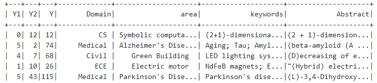
Deleting Spaces in ‘Domain’ , ‘area’ and ‘keywords’.
```
%pyspark
from pyspark.sql.functions import *
from pyspark.sql.functions import udf
from pyspark.sql.types import StringType
spaceDeleteUDF = udf(lambda s: s.replace(" ", ""), StringType())
df = df.withColumn('Domain', spaceDeleteUDF("Domain"))
df = df.withColumn('area', trim(df.area))
df = df.withColumn('keywords', trim(df.keywords))
df.show()
```
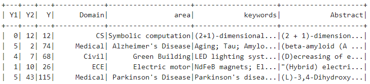
Capitalize 'Domain' and lowercase all other columns.
```
%pyspark
from pyspark.sql import functions as F
uppercolumns = ['Domain']
for col in uppercolumns:
    df = df.withColumn(col, F.upper(F.col(col)))
lowercolumns = ['area','keywords','Abstract']
for col in lowercolumns:
    df = df.withColumn(col, F.lower(F.col(col)))
    
df.show()
```
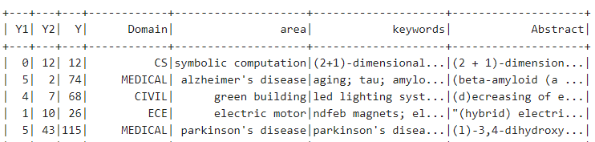

## EDA
### Select domain, show the category(Y1) of each Domain
```
%pyspark
df1 = df.select(df['Domain'],df['area'],df['keywords'])
df.select(df["Domain"],df["Y1"]).distinct().show()
```
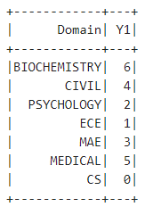
### Count and find the largest domain 
```
%pyspark
from pyspark.sql.functions import desc
df_domain = (df1.groupBy('Domain').count())
df_domain.sort(desc("count")).show()
```
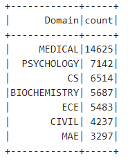

```
%pyspark
print df_domain.columns
df_domain.registerTempTable('domain')
print sqlContext.read.table('domain').dtypes

%sql
SELECT Domain, count FROM domain
ORDER BY count DESC
```
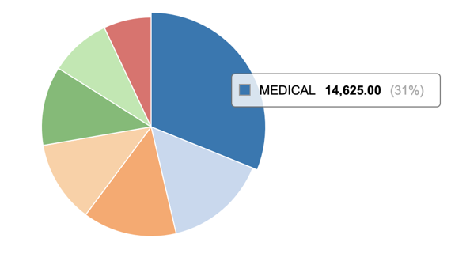
### Count and find the largest area in Medical 
```
%pyspark
df_area = (df2.groupBy('area').count())
df_area.sort(desc("count")).limit(5).show()

%pyspark
df_area.registerTempTable('area')
%sql
SELECT area, count FROM area
WHERE count>330
ORDER BY count DESC
```
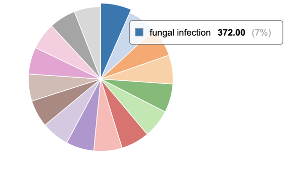

### Count keywords in Fungal Infection
```
%pyspark
df3 = (df2
        .filter(df2['area'] == 'fungal infection')
        .select(df2['keywords']))
df3.limit(5).show()

%pyspark
from pyspark.sql.functions import col, explode, split

df4 = df3.withColumn(
    "keywords", 
    explode(split(col('keywords'), "; "))
)
 
%pyspark
df_keywords = (df4.groupBy('keywords').count())
df_keywords.sort(desc("count")).limit(5).show()
 
%pyspark
df_keywords.registerTempTable('keywords')
%sql
SELECT keywords, count FROM keywords
ORDER BY count DESC
LIMIT 5
```
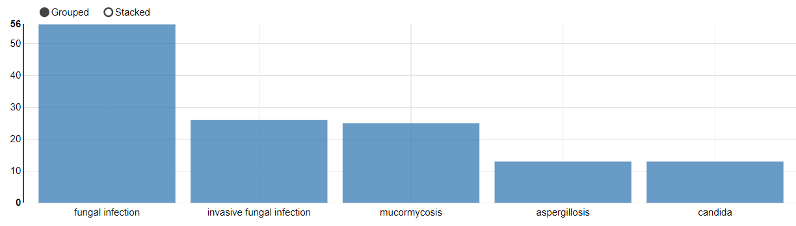

## Data Ingestion and Extraction
### Model Pipline
1.regexTokenizer: Tokenization (with Regular Expression)<br/>
2.stopwordsRemover: Remove Stop Words<br/>
3.countVectors: Count vectors (“document-term vectors”)<br/>
```
%pyspark
from pyspark.ml.feature import RegexTokenizer, StopWordsRemover, CountVectorizer
from pyspark.ml.classification import LogisticRegression

regexTokenizer = RegexTokenizer(inputCol="Abstract", outputCol="words", pattern="\\W")
add_stopwords = ['background','objective','aim','introduction','purpose','rationale','design','question']
stopwordsRemover = StopWordsRemover(inputCol="words", outputCol="filtered").setStopWords(add_stopwords)
countVectors = CountVectorizer(inputCol="filtered", outputCol="features", vocabSize=10000, minDF=5)
```

### StringIndexer
StringIndexer encodes a string column of labels to a column of label indices. The most frequent label(Medical) will be indexed as 0.
```
%pyspark
from pyspark.ml import Pipeline
from pyspark.ml.feature import OneHotEncoder, StringIndexer, VectorAssembler
label_stringIdx = StringIndexer(inputCol = "Domain", outputCol = "label")
pipeline = Pipeline(stages=[regexTokenizer, stopwordsRemover, countVectors, label_stringIdx])
# Fit the pipeline to training documents.
pipelineFit = pipeline.fit(data)
dataset = pipelineFit.transform(data)
dataset.show(5)
```
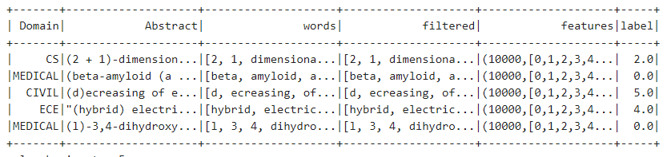

### Partition Training & Test sets
```
%pyspark
(trainingData, testData) = dataset.randomSplit([0.7, 0.3], seed = 100)
print("Training Dataset Count: " + str(trainingData.count()))
print("Test Dataset Count: " + str(testData.count()))
```
Training Dataset Count: 33009<\br>
Test Dataset Count: 13986
### Model Training and Evaluation
#### Logistic Regression using Count Vector Features
Count Vector is a matrix notation of the dataset in which every row represents a document from the corpus, every column represents a term from the corpus, and every cell represents the frequency count of a particular term in a particular document.
```
%pyspark
lr = LogisticRegression(maxIter=20, regParam=0.3, elasticNetParam=0)
lrModel = lr.fit(trainingData)
predictions = lrModel.transform(testData)
predictions.filter(predictions['prediction'] == 0) \
    .select("Abstract","Domain","probability","label","prediction") \
    .orderBy("probability", ascending=False) \
    .show(n = 10, truncate = 30)
```
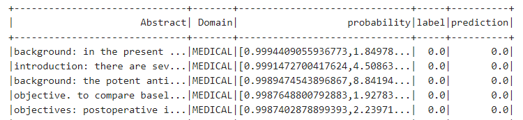
```
%pyspark
from pyspark.ml.evaluation import MulticlassClassificationEvaluator
evaluator = MulticlassClassificationEvaluator(predictionCol="prediction")
evaluator.evaluate(predictions)
```
0.87
#### Logistic Regression using TF-IDF Features
TF-IDF technique is a popular approach in counting the number of times each word appears in a document.<\br>
Term Frequency (TF) = (Number of times term t appears in a document)/(Number of terms in the document)<\br>
Inverse Document Frequency (IDF) = log(N/n). The IDF of a rare word is high, whereas the IDF of a frequent word is likely to be low.<\br> 
The feature shows word that are more important from the context of the entire corpus.
```
%pyspark
from pyspark.ml.feature import HashingTF, IDF
hashingTF = HashingTF(inputCol="filtered", outputCol="rawFeatures", numFeatures=10000)
idf = IDF(inputCol="rawFeatures", outputCol="features", minDocFreq=5) #minDocFreq: remove sparse terms
pipeline = Pipeline(stages=[regexTokenizer, stopwordsRemover, hashingTF, idf, label_stringIdx])
pipelineFit = pipeline.fit(data)
dataset = pipelineFit.transform(data)
(trainingData, testData) = dataset.randomSplit([0.7, 0.3], seed = 100)
lr = LogisticRegression(maxIter=20, regParam=0.3, elasticNetParam=0)
lrModel = lr.fit(trainingData)
predictions = lrModel.transform(testData)
predictions.filter(predictions['prediction'] == 0) \
    .select("Abstract","Domain","probability","label","prediction") \
    .orderBy("probability", ascending=False) \
    .show(n = 10, truncate = 30)
```
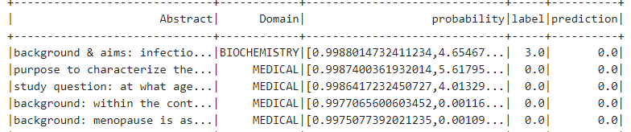
```
%pyspark
evaluator = MulticlassClassificationEvaluator(predictionCol="prediction")
evaluator.evaluate(predictions)
```
0.78

#### Cross-Validation
```
%pyspark
pipeline = Pipeline(stages=[regexTokenizer, stopwordsRemover, countVectors, label_stringIdx])
pipelineFit = pipeline.fit(data)
dataset = pipelineFit.transform(data)
(trainingData, testData) = dataset.randomSplit([0.7, 0.3], seed = 100)
lr = LogisticRegression(maxIter=20, regParam=0.3, elasticNetParam=0)
from pyspark.ml.tuning import ParamGridBuilder, CrossValidator
# Create ParamGrid for Cross Validation
paramGrid = (ParamGridBuilder()
             .addGrid(lr.regParam, [0.1, 0.3, 0.5]) # regularization parameter
             .addGrid(lr.elasticNetParam, [0.0, 0.1, 0.2]) # Elastic Net Parameter (Ridge = 0)
#            .addGrid(model.maxIter, [10, 20, 50]) #Number of iterations
#            .addGrid(idf.numFeatures, [10, 100, 1000]) # Number of features
             .build())
# Create 5-fold CrossValidator
cv = CrossValidator(estimator=lr, \
                    estimatorParamMaps=paramGrid, \
                    evaluator=evaluator, \
                    numFolds=5)
cvModel = cv.fit(trainingData)

predictions = cvModel.transform(testData)
# Evaluate best model
evaluator = MulticlassClassificationEvaluator(predictionCol="prediction")
evaluator.evaluate(predictions)
```
0.81
#### Naive Bayes
```
%pyspark
from pyspark.ml.classification import NaiveBayes
nb = NaiveBayes(smoothing=1)
model = nb.fit(trainingData)
predictions = model.transform(testData)
predictions.filter(predictions['prediction'] == 0) \
    .select("Abstract","Domain","probability","label","prediction") \
    .orderBy("probability", ascending=False) \
    .show(n = 10, truncate = 30)
```
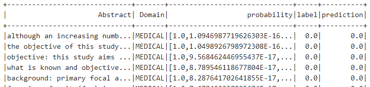
```
%pyspark
evaluator = MulticlassClassificationEvaluator(predictionCol="prediction")
evaluator.evaluate(predictions)
```
0.73
#### Random Forest
```
%pyspark
from pyspark.ml.classification import RandomForestClassifier
rf = RandomForestClassifier(labelCol="label", \
                            featuresCol="features", \
                            numTrees = 2000, \
                            maxDepth = 5, \
                            maxBins = 128)
# Train model with Training Data
rfModel = rf.fit(trainingData)
predictions = rfModel.transform(testData)
predictions.filter(predictions['prediction'] == 0) \
    .select("Abstract","Domain","probability","label","prediction") \
    .orderBy("probability", ascending=False) \
    .show(n = 10, truncate = 30)
```
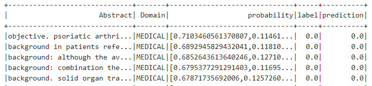
```
%pyspark
evaluator = MulticlassClassificationEvaluator(predictionCol="prediction")
evaluator.evaluate(predictions)
```
0.71
